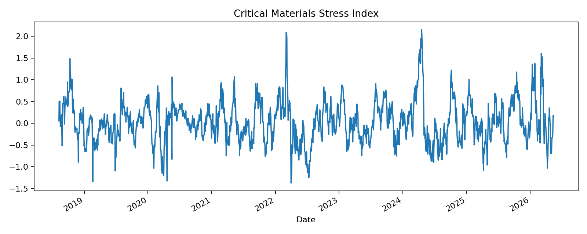
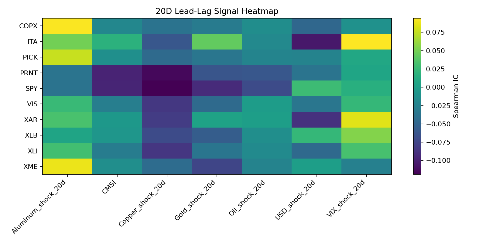
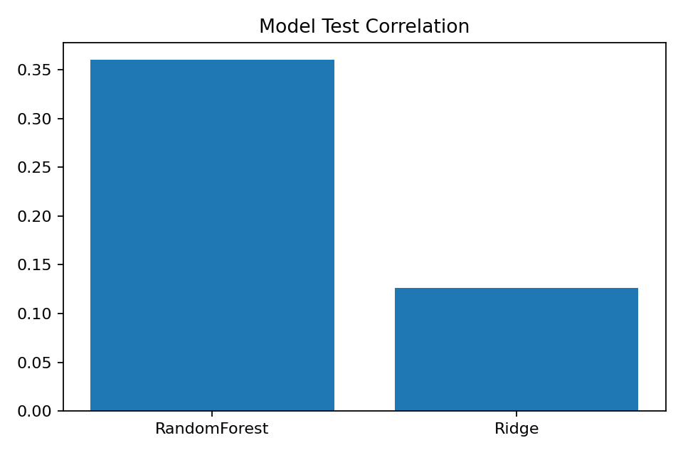
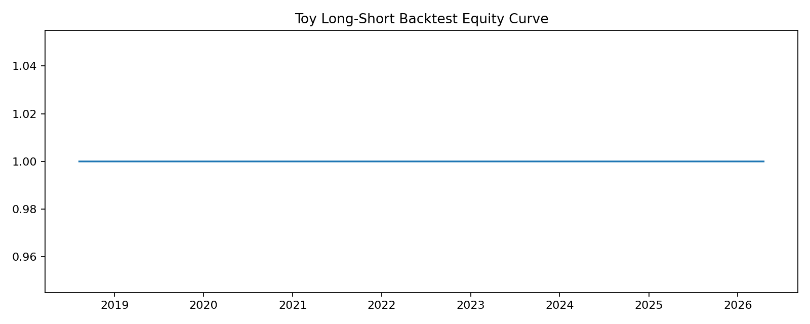
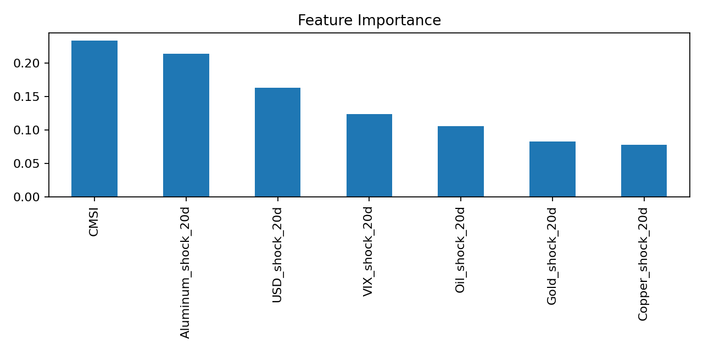

# MatQuantLab

## Critical Materials Intelligence Layer for Cross-Asset ML Research

MatQuantLab is a materials-informed machine learning and quantitative research platform focused on one core question:

> Can stress in metals, energy, volatility, USD pressure, and industrial supply chains contain early information about industrial and manufacturing-related assets?

Unlike generic “AI stock prediction” projects, MatQuantLab combines:

* materials engineering
* commodity stress analysis
* industrial exposure mapping
* additive manufacturing watchlists
* cross-asset ML research
* interactive dashboards

The project is designed as a research and portfolio platform — not a trading bot.

---

# Live Interactive Dashboard

### Live app

[MatQuantLab Live Dashboard](https://matquantlab-gegdszewybwbbbdvm5kbnc.streamlit.app/?utm_source=chatgpt.com)

The dashboard updates market data using Yahoo Finance through `yfinance`.

---

# What The Dashboard Actually Does

The app tries to answer questions like:

* Does copper stress affect mining equities?
* Does oil stress pressure aerospace and industrial companies?
* Does volatility lead additive-manufacturing drawdowns?
* Do industrial-materials signals contain lead-lag information?
* Which macro/materials factors matter most for different sectors?

The dashboard transforms commodity and macro signals into interpretable research indicators.

---

# Main Dashboard Sections

## 1. Industrial Stress Radar

This is the core monitoring panel.

It builds a weighted stress index called:

```text
CMSI v2 = Critical Materials Stress Index
```

The index combines:

| Signal   | Why It Matters                         |
| -------- | -------------------------------------- |
| Copper   | industrial demand and electrification  |
| Aluminum | energy-intensive manufacturing         |
| Oil      | transport and production cost pressure |
| USD      | commodity pressure and liquidity       |
| VIX      | market fear and risk appetite          |
| Gold     | defensive/safe-haven behavior          |

The dashboard classifies the environment into:

```text
Normal
Elevated Stress
Extreme Stress
Relief / Easing
```

### How to understand it

* High CMSI → industrial/materials stress increasing
* Low CMSI → stress easing
* Rising VIX + rising CMSI → possible industrial risk regime
* Falling copper + weak mining ETFs → possible metals slowdown

---

## 2. Lead-Lag Signal Lab

This section tests whether a signal may lead future returns.

Example:

```text
Copper shock today
↓
Mining ETF moves later
```

The app computes correlations between stress signals and future returns.

### Important metrics

| Metric       | Meaning                          |
| ------------ | -------------------------------- |
| Spearman IC  | strength of ranking relationship |
| Pearson Corr | linear relationship              |
| Rows         | amount of aligned data           |

### How to interpret

* Positive IC → feature may lead positive future return
* Negative IC → feature may lead weakness/risk
* Large absolute value → stronger relationship

This is NOT proof of profitability. It is research exploration.

---

## 3. ML Explainability

This section trains simple ML models.

Current models:

```text
Ridge Regression
Random Forest
```

The app predicts future returns using stress features.

### Outputs

| Output                 | Meaning                                            |
| ---------------------- | -------------------------------------------------- |
| RMSE                   | prediction error                                   |
| Prediction Correlation | alignment between predictions and realized returns |
| Feature Importance     | which variables influenced the model most          |

### Example interpretation

```text
Prediction negative
Main drivers:
- VIX stress high
- USD strengthening
- Copper weakening
```

The goal is interpretability, not black-box hype.

---

## 4. Additive Manufacturing Watchlist

This section tracks additive-manufacturing-linked assets.

Current basket:

```text
PRNT
DDD
SSYS
MTLS
NNDM
```

The goal is to test whether AM-linked equities respond differently to industrial/materials stress than broad industrial sectors.

### Example question

```text
Does high industrial stress hurt additive-manufacturing equities more than normal industrial ETFs?
```

This is one of the niche parts of the project.

---

## 5. Toy Research Backtest

This is NOT a production trading system.

The backtest only demonstrates how a signal might behave historically.

Current simplified logic:

```text
Prediction > 0 → long
Prediction < 0 → short
```

Missing professional components:

* transaction costs
* slippage
* liquidity limits
* borrow costs
* portfolio optimization
* walk-forward validation

The backtest exists for research visualization only.

---

## 6. Raw Data

Shows downloaded prices and generated features.

Useful for:

* debugging
* verifying downloaded data
* checking signal construction
* understanding feature behavior

---

# Asset Universe

| Ticker | Theme                      |
| ------ | -------------------------- |
| XME    | mining and metals          |
| COPX   | copper miners              |
| PICK   | global mining              |
| XLB    | materials sector           |
| ITA    | aerospace and defense      |
| XAR    | aerospace supply chain     |
| XLI    | industrials                |
| VIS    | broad industrials          |
| PRNT   | additive manufacturing ETF |
| DDD    | additive manufacturing     |
| SSYS   | additive manufacturing     |
| MTLS   | digital manufacturing      |
| NNDM   | advanced manufacturing     |
| SPY    | market benchmark           |

---

# Automated Research Pipeline

The repository also includes GitHub Actions automation.

Generated outputs include:

```text
outputs/figures/cmsi.png
outputs/figures/signal_decay_heatmap.png
outputs/figures/model_leaderboard.png
outputs/figures/backtest_equity_curve.png
outputs/figures/feature_importance.png
```

The pipeline can be run manually from:

```text
Actions → Run MatQuantLab Research Pipeline
```

---

# Automated Research Outputs

## Critical Materials Stress Index



## Lead-Lag Signal Heatmap



## ML Model Comparison



## Strategy Equity Curve



## Feature Importance



---

# How To Run Locally

Install dependencies:

```bash
pip install -r requirements.txt
```

Run dashboard:

```bash
streamlit run app/live_dashboard.py
```

---

# Suggested First Experiments

### Mining / metals stress

```text
Asset: XME
Interval: 5m
Period: 5d
Model: Ridge
```

### Copper sensitivity

```text
Asset: COPX
```

### Aerospace / defense stress

```text
Asset: ITA
```

### Additive manufacturing sensitivity

```text
Asset: PRNT
DDD
SSYS
```

---

# Current Project Status

Working:

* interactive Streamlit dashboard
* commodity stress analysis
* lead-lag signal testing
* ML explainability
* additive-manufacturing watchlist
* automated GitHub Actions pipeline
* automated figure generation

Still improving:

* walk-forward validation
* transaction costs
* factor neutralization
* sector-neutral ranking
* regime clustering
* professional data feeds
* portfolio optimization

---

# Important Disclaimer

MatQuantLab is a research and educational project.

It is NOT:

* financial advice
* a production trading system
* guaranteed alpha
* institutional-grade execution infrastructure

Free market data may contain delays, errors, and survivorship bias.

---

# One-Line Summary

MatQuantLab converts critical-materials and industrial stress information into interpretable cross-asset ML research signals for mining, aerospace, defense, industrial, and additive-manufacturing-linked assets.
